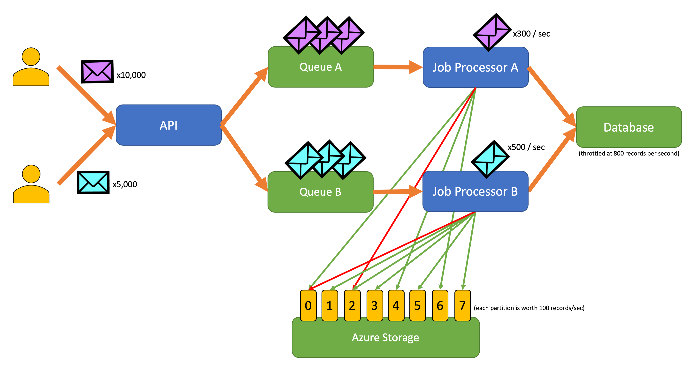

# Rate Limiting Pattern

Many services use [throttling](https://docs.microsoft.com/en-us/azure/architecture/patterns/throttling) to control the consumption of resources. As a consumer of a service that imposes this limitation, you might choose to rate limit operations to that service. This will help you avoid or minimize throttling errors and help you more accurately predict throughput.

While rate limiting may be appropriate in many scenarios, it is a pattern that is particularly helpful for batch processing.

## Context and problem

Rate limiting can reduce your traffic and potentially improve throughput by reducing the number of records sent to the service. Consider the following naive approach to retry on error:

1. Your application needs to ingest 10K records into Cosmos DB. Each record costs 10 RU, requiring a total of 100K RU to complete the job.
1. Your Cosmos DB instance has 20K RU provisioned capacity.
1. You send all 10K records to Cosmos DB. 2K records are written successfully and 8K records are rejected.
1. You send the remaining 8K records to Cosmos DB. 2K records are written successfully and 6K records are rejected.
1. You send the remaining 6K records to Cosmos DB. 2K records are written successfully and 4K records are rejected.
1. You send the remaining 4K records to Cosmos DB. 2K records are written successfully and 2K records are rejected.
1. You send the remaining 2K records to Cosmos DB. All are written successfully.

The ingestion job completely successfully but only after sending 30K records to Cosmos DB when only 10K records needed to be written.

There are additional factors to consider in the above example as well:

- The naive approach will have handled 20K errors, which often result in additional logging.
- The naive approach can have no expectation on how long data processing will take, whereas with rate limiting you can calculate the time required for ingestion.
- When using a message queuing system, the rate limiting approach can dequeue only the records that can be processed in a given interval saving memory.

## Solution

A service may throttle based on different metrics over a period of time, such as:

- The number of operations (ex. 20 requests per second)
- The amount of data (ex. 2 GiB per minute)
- The relative cost of operations (ex. 20K RU per second)

Regardless of the metric used for throttling, the implementation of rate limiting will involve controlling the number and/or size of operations sent to the service in a period of time.

Often the throttled service will need to accept records at a slower rate than the API might accept them. If you simply consider this a data rate mismatch problem and buffer in your application you may be introducing the possibility that data could be lost if your application crashes. Instead consider sending the records to a durable messaging system that can handle your full ingestion rate (services such as Azure Event Hubs can handle millions of operations per second). One or more job processors can read the records from the durable messaging system at a controlled rate that within the limits of the throttled service.

Azure provides a number of durable messaging services that would be suitable for this pattern, including:

- [Azure Service Bus](https://azure.microsoft.com/en-us/services/service-bus/)
- [Azure Queue Storage](https://azure.microsoft.com/en-us/services/storage/queues/)
- [Azure Event Hubs](https://azure.microsoft.com/en-us/services/event-hubs/)

The time period used for releasing records may be more granular than the period the service throttles on. While this is not required, it is often recommended to improve throughput. For instance, if a service allows 100 records per second, the implementation of a rate limiter may release 20 records every 200 milliseconds. The following graph shows what this might look like:

It is sometimes necessary for uncoordinated processes to share the capacity of a throttled service. To accomplish this you can logically partition that capacity and then use a distributed mutual exclusion system to manage exclusive locks on those partitions. The uncoordinated processes can then compete for locks on those partitions whenever they need capacity. For each partition that a process holds a lock for, it would be granted a certain amount of capacity.

For example, if the throttled system allows 500 requests per second, you might create 20 partitions worth 25 requests per second each. If a process needed to issue 100 requests, it might ask the distributed mutual exclusion system for 4 partitions. The system might grant 2 partitions for 10 seconds. The process would then rate limit to 50 requests per second, complete the task in 2 seconds, and then release the lock.

Azure Storage can be used to implement a pattern like this. You can create one 0-byte blob per logical partition in a container and then obtain [exclusive leases](https://docs.microsoft.com/en-us/rest/api/storageservices/lease-blob) directly against those blobs for a short period of time (ex. 15 seconds). The application will need to track the lease time so that when it expires, it can stop using the capacity it was granted. When implementing this pattern, you often want each process that needs capacity to attempt a lease on a random partition.

To reduce latency, you might allocate each process a small amount of capacity that is reserved only for that process to use. Each process would then only seek to obtain shared capacity if it needed to exceed its reserved capacity.

:notebook: This is one implementation of a lease management system. A similar process could be implemented using Zookeeper, Consul, etcd, Redis/Redsync, and others.

## Issues and considerations

Consider the following points when deciding how to implement this pattern:

- While the rate limiting pattern can reduce the number of throttling errors, your application should still properly handle throttling errors when they do occur.

- An application might have multiple workstreams that access the same throttled service. For instance, your application might support bulk loading records into a database but also querying for records in that same database. You might share the same capacity by ensuring all workstreams are gated through the same rate limiting mechanism. Alternatively, you might reserve separate pools of capacity for each workstream.

- Operations may be sent to the throttled service from multiple applications. It some cases, it is possible to coordinate that usage (as shown above), but this is not possible in every case. You may consider temporarily reducing the throughput imposed by your rate limiting mechanism when you start seeing a larger than expected number of throttling errors as this may be a sign of contention between applications.

## When to use this pattern

Use this pattern:

- To reduce throttling errors raised by an throttled service.
- To reduce traffic over a naive approach of retry on error.
- To reduce memory consumption by dequeuing only records for which there is capacity to process.

## Example

An application allows users to submit records of various types to an API. There is a unique job processor for each record type that perform the following steps:

1. validation
1. enrichment
1. insert record to database

All components of the application (API, job processor A, and job processor B) are separate processes that may be scaled independently. The processes do not directly communicate with one another.

The diagram shows the following workflow:

1. A user submits 10,000 records of type A to the API.
1. The API enqueues those 10,000 records in Queue A.
1. A user submits 5,000 records of type B to the API.
1. The API enqueues those 5,000 records in Queue B.
1. Job Processor A sees Queue A has records and tries to gain an exclusive lease on blob 2.
1. Job Processor B sees Queue B has records and tries to gain an exclusive lease on blob 2.
1. Job Processor A fails to obtain the lease.
1. Job Processor B obtains the lease on blob 2 for 15 seconds. It can now rate limit requests to the database at a rate of 100 per second.
1. Job Processor B dequeues 100 records from Queue B and writes them.
1. 1 second passes.
1. Job Processor A sees Queue A has more records and tries to gain an exclusive lease on blob 6.
1. Job Processor B sees Queue B has more records and tries to gain an exclusive lease on blob 3.
1. Job Processor A obtains the lease on blob 6 for 15 seconds. It can now rate limit requests to the database at a rate of 100 per second.
1. Job Processor B obtains the lease on blob 3 for 15 seconds. It can now rate limit requests to the database at a rate of 200 per second (it also holds the lease for blob 2).
1. Job Processor A dequeues 100 records from Queue A and writes them.
1. Job Processor B dequeues 200 records from Queue B and writes them.
1. 1 second passes.
1. Job Processor A sees Queue A has more records and tries to gain an exclusive lease on blob 0.
1. Job Processor B sees Queue B has more records and tries to gain an exclusive lease on blob 1.
1. Job Processor A obtains the lease on blob 0 for 15 seconds. It can now rate limit requests to the database at a rate of 200 per second (it also holds the lease for blob 6).
1. Job Processor B obtains the lease on blob 1 for 15 seconds. It can now rate limit requests to the database at a rate of 300 per second (it also holds the lease for blobs 2 and 3).
1. Job Processor A dequeues 200 records from Queue A and writes them.
1. Job Processor B dequeues 300 records from Queue B and writes them.
1. And so on...

After 15 seconds, one or both jobs still will not be completed. As the leases expire, a processor should also reduce the number of requests it dequeues and write.

## Related patterns and guidance

The following patterns and guidance might also be relevant when implementing this pattern:

- [Throttling](https://docs.microsoft.com/en-us/azure/architecture/patterns/throttling). The rate limiting pattern discussed here is typically implemented in response to a service that is throttled.
- [Retry](https://docs.microsoft.com/en-us/azure/architecture/patterns/retry). When throttling errors are raised by the throttled service it is generally appropriate to retry those after an appropriate interval.
